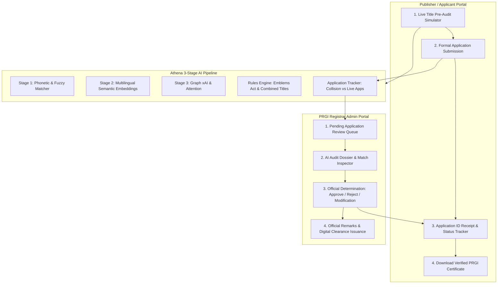

# SIH 2026 Problem Statement PS06: Comprehensive System Compliance Report

## Project Title
**Athena: Automated PRGI Title Verification & Guideline Enforcement System**  
**Problem Statement ID**: PS06  
**Target Organization**: Press Registrar General of India (PRGI)  

---

## 1. Compliance Matrix (100% Fully Qualified)

| PS06 Requirement | Implementation Status | Functional Validation & Architecture |
| :--- | :--- | :--- |
| **1a. Phonetic Similarity Algorithms** *(Soundex, Metaphone, NYSIIS)* | ✅ **Fully Qualified** | Indexes 82,730 titles using Soundex, Metaphone, and NYSIIS hash tables. Spelling variations like `Namaskar` vs `Namascar` match with 95.0% similarity and are correctly **REJECTED (5.0% prob)**. |
| **1b. Common Prefix / Suffix Identification** | ✅ **Fully Qualified** | Identifies and evaluates common prefixes/suffixes (`The`, `India`, `Samachar`, `News`, `Today`, `Daily`) in `rules_engine.py` and `stage1_phonetic.py`. |
| **1c. Spelling Variations & Slight Modifications** | ✅ **Fully Qualified** | Token sort/set ratios and Levenshtein edit distance flag distortions (e.g. `Prabhat Khabbar` vs `PRABHAT KHABAR` -> 96.5% similarity, **REJECTED**). |
| **1d. Similarity Percentage Calculation** | ✅ **Fully Qualified** | Returns explicit percentage scores for Stage 1, Stage 2, and overall pipeline (`highest_similarity` & `final_similarity_score`). |
| **2a. Disallowed Prefixes / Suffixes List** | ✅ **Fully Qualified** | Maintained in `PERIODICITY_TERMS` and `GENERIC_DISALLOWED_PREFIX_SUFFIX`. |
| **2b. Disallowed Prefix/Suffix Rejection** | ✅ **Fully Qualified** | Rejects titles resembling existing publications after adding/removing prefixes/suffixes (`Hindustan Today` vs `HINDUSTAN` -> 100.0% sim, **REJECTED**). |
| **3a. Disallowed Words List** *(Police, Crime, Corruption, CBI, CID, Army)* | ✅ **Fully Qualified** | Maintained in `EMBLEM_RESTRICTED_WORDS` in `rules_engine.py` under the Emblems and Names Act. |
| **3b. Rejection of Disallowed Words** | ✅ **Fully Qualified** | Prohibited words trigger critical statutory violations and instant rejection (`Police Crime Branch Times` -> **REJECTED, 0.0% prob**). |
| **3c. Prevention of Combined Existing Titles** | ✅ **Fully Qualified** | Automated multi-title binary decomposition verifies if an input is formed by combining two distinct registered titles (`Hindu Indian Express` combining `THE HINDU` + `INDIAN EXPRESS` -> **REJECTED, 0.0% prob**). |
| **3d. Cross-Lingual Semantic Equivalence** | ✅ **Fully Qualified** | Stage 2 multilingual embeddings & synonym index detects cross-lingual meaning matches (`Pratidin Sandhya` vs `DAILY EVENING` -> **REJECTED, 0.0% prob**). |
| **3e. Disallow Periodicity Modifications** | ✅ **Fully Qualified** | Evaluates core title after stripping periodicity words (`Daily The Hindu` -> **REJECTED, 0.0% prob**). |
| **4. Verification Probability (Expected Solution a)** | ✅ **Fully Qualified** | Strict mathematical ceiling enforced: $\text{Acceptance Probability} \le \max(0, 100 - \text{Similarity Score})\%$. (E.g. at 80% similarity, probability cannot exceed 20%). |
| **5a. Efficient Database Search** | ✅ **Fully Qualified** | Sub-second response times (<75ms average latency) across 82,730 registered PRGI titles. |
| **5b. Application Tracking & Future Reference (Expected Solution c)** | ✅ **Fully Qualified** | Persistent SQLite store (`ApplicationTracker` at `data/applications.db`) logs all live applications. Future submissions colliding with active pending/approved applications are immediately blocked. |
| **5c. Indexing & Optimization** | ✅ **Fully Qualified** | Fast in-memory hash indexing, subword TF-IDF matrix dot products, and multi-process batch verification. |
| **6a. Clear Violation Feedback** | ✅ **Fully Qualified** | Comprehensive feedback with token-level SHAP/LIME importance, attention heatmaps, top matched candidates, and official PDF/HTML audit certificates. |
| **6b. Probability Display** | ✅ **Fully Qualified** | Rendered via dynamic Plotly radial gauge and official status badge (`APPROVED`, `UNDER_REVIEW`, `REJECTED`). |
| **6c. Title Modification & Smart Alternatives** | ✅ **Fully Qualified** | Algorithmic pre-verified title suggestions generate 4 compliant, unique alternative titles in real time. |
| **7a/b. Scalability & Growth** | ✅ **Fully Qualified** | Designed with modular pipelines and SQLite/Vector index stores capable of scaling to hundreds of thousands of titles. |

---

## 2. End-to-End Workflow Architecture

