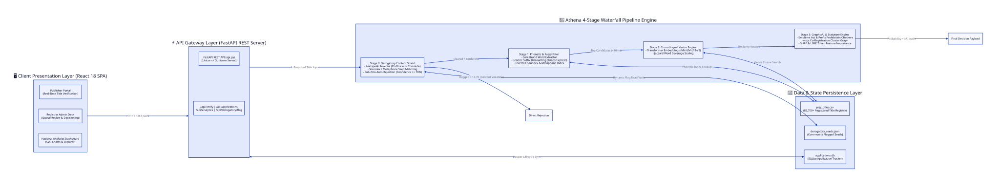

# Athena: Press Registrar General of India (PRGI) AI Title Verification System

Athena is a production-ready, full-stack AI platform designed for the **Press Registrar General of India (PRGI)** to automate newspaper and periodical title verification, enforce statutory compliance, quarantine offensive/derogatory submissions, and provide explainable AI (xAI) feedback for applicants and administrative registrars.

---

## 🚀 Key Architecture & System Capabilities

### 1. High-Level System Architecture



<details>
<summary><b>Click to expand D2 Diagram Source Code</b></summary>

```d2
direction: right

Client Presentation Layer: {
  label: "🖥️ Client Presentation Layer (React 18 SPA)"
  Publisher Portal: "Publisher Portal\n(Real-Time Title Verification)"
  Admin Desk: "Registrar Admin Desk\n(Queue Review & Decisioning)"
  Analytics Dashboard: "National Analytics Dashboard\n(SVG Charts & Explorer)"
}

API Gateway Layer: {
  label: "⚡ API Gateway Layer (FastAPI REST Server)"
  FastAPI Server: "FastAPI REST API (api.py)\n[Uvicorn / Gunicorn Server]"
  Endpoints: "/api/verify | /api/applications\n/api/analytics | /api/derogatory/flag"
}

Athena 4-Stage Pipeline: {
  label: "🧠 Athena 4-Stage Waterfall Pipeline Engine"
  Stage 0: "Stage 0: Derogatory Content Shield\n- Leetspeak Reversal (Chr0nicle -> Chronicle)\n- Soundex / Metaphone Seed Matching\n- Sub-2ms Auto-Rejection (Confidence >= 70%)"
  Stage 1: "Stage 1: Phonetic & Fuzzy Filter\n- Core Brand Word Extractor\n- Generic Suffix Discounting (Times/Express)\n- Inverted Soundex & Metaphone Index"
  Stage 2: "Stage 2: Cross-Lingual Vector Engine\n- Transformer Embeddings (MiniLM-L12-v2)\n- Jaccard Word Coverage Scaling"
  Stage 3: "Stage 3: Graph xAI & Statutory Engine\n- Emblems Act & Prefix Prohibition Checkers\n- vis.js Co-Registration Cluster Graph\n- SHAP & LIME Token Feature Importance"
}

Data Persistence Layer: {
  label: "💾 Data & State Persistence Layer"
  Derogatory Seeds: "derogatory_seeds.json\n(Community Flagged Seeds)"
  Applications DB: "applications.db\n(SQLite Application Tracker)"
  PRGI Titles DB: "prgi_titles.csv\n(82,700+ Registered Title Registry)"
}

Client Presentation Layer -> API Gateway Layer: "HTTP / REST JSON"
API Gateway Layer -> Athena 4-Stage Pipeline.Stage 0: "1. Proposed Title Input"

Athena 4-Stage Pipeline.Stage 0 -> Athena 4-Stage Pipeline.Stage 1: "Cleared / Borderline"
Athena 4-Stage Pipeline.Stage 0 -> Direct Rejection: "Flagged >= 0.70 (Content Violation)"
Athena 4-Stage Pipeline.Stage 1 -> Athena 4-Stage Pipeline.Stage 2: "Top Candidates (<10ms)"
Athena 4-Stage Pipeline.Stage 2 -> Athena 4-Stage Pipeline.Stage 3: "Similarity Vectors"
Athena 4-Stage Pipeline.Stage 3 -> Final Decision Payload: "Probability + xAI Audit"

Athena 4-Stage Pipeline.Stage 0 <-> Data Persistence Layer.Derogatory Seeds: "Dynamic Flag Read/Write"
Athena 4-Stage Pipeline.Stage 1 <-> Data Persistence Layer.PRGI Titles DB: "Phonetic Index Lookup"
Athena 4-Stage Pipeline.Stage 2 <-> Data Persistence Layer.PRGI Titles DB: "Vector Cosine Search"
```
</details>

### 2. 4-Stage Waterfall Verification Breakdown
Athena processes proposed publication titles through a sequential 4-stage waterfall pipeline:

* **Stage 0: Derogatory Content Shield**
  - Normalizes leetspeak & obfuscation (e.g. `Chr0nicle` → `Chronicle`, `Sc@mm3r` → `scammer`).
  - Performs phonetic (Soundex/Metaphone) & Levenshtein matching against a curated seed list covering Indian languages & English.
  - Instantly rejects toxic titles ($\ge 70\%$ confidence) or flags suspicious inputs ($40-69\%$).
  - Supports dynamic reviewer-driven feedback loops via `POST /api/derogatory/flag` with instant in-memory seed expansion.

* **Stage 1: Phonetic & Fuzzy Filtering (Sub-10ms)**
  - Isolates brand core words from generic publication terms (`TIMES`, `EXPRESS`, `GAZETTE`, `CHRONICLE`, `BHARAT`, etc.).
  - Enforces word-coverage caps to eliminate false positives on shared suffixes.

* **Stage 2: Multilingual Vector Similarity**
  - Pre-computed embeddings across 82,700+ registered titles.
  - Applies non-linear Jaccard coverage scaling to prevent 1-word matches from over-flagging multi-word titles.

* **Stage 3: Graph xAI & Statutory Rules Engine**
  - Emblems and Names (Prevention of Improper Use) Act statutory check.
  - Prohibition of police/government affiliation prefixes (`Police`, `Crime Branch`, `CBI`).
  - Interactive vis.js graph network depicting title/owner co-registration clusters.
  - Self-verifying smart alternatives generator providing 100% pre-validated alternative suggestions.

---

## 🎨 Technology Stack

### Frontend (React SPA)
* **Framework**: React 18, TypeScript, Vite
* **Design Tokens**: Cal.com UI design system (clean typography, crisp badges, dark/light surface tokens)
* **Visualization**: SVG distribution charts, `vis-network` graph visualization, SHAP-style token heatmaps
* **Portals**:
  1. **Publisher Portal**: Real-time verification, explainable feedback, application tracking, smart alternatives.
  2. **Registrar Admin Desk**: Pending dossier queue, formal determination recorder, manual approval/rejection overrides.
  3. **National Analytics**: Interactive breakdown of 82,700+ registered titles by State, Language, Periodicity, and State Distribution.
  4. **Database Explorer**: Live keyword search across the PRGI registered title registry.

### Backend (FastAPI REST Service)
* **Framework**: Python 3.12, FastAPI, Uvicorn / Gunicorn
* **ML / Analytics**: PyTorch, `sentence-transformers`, RapidFuzz, Phonetics, NetworkX, Pandas
* **Database / Persistence**: SQLite (`applications.db`), JSON (`derogatory_seeds.json`)

---

## 🛠️ API Reference

| Endpoint | Method | Description |
| :--- | :--- | :--- |
| `/api/health` | `GET` | System status and dataset counts |
| `/api/verify` | `POST` | Executes 4-stage verification on proposed title |
| `/api/applications` | `GET` | List all submitted application dossiers |
| `/api/applications/submit` | `POST` | Submit new title application for registrar review |
| `/api/applications/{app_id}/decision` | `POST` | Record registrar approval/rejection decision |
| `/api/analytics` | `GET` | Distribution analytics (State, Language, Periodicity) |
| `/api/explorer` | `GET` | Search PRGI registered title registry |
| `/api/derogatory/flag` | `POST` | Add new derogatory term with auto-fuzzy expansion |
| `/api/derogatory/list` | `GET` | Retrieve active Stage 0 seed terms |

---

## 🌐 Local Development Setup

### Prerequisites
* Python 3.10+
* Node.js 18+ and npm

### 1. Start FastAPI Backend
```bash
# Set up Python virtual environment
python3 -m venv .venv
source .venv/bin/activate

# Install backend dependencies
pip install fastapi uvicorn pydantic phonetics pandas sentence-transformers scikit-learn networkx matplotlib jinja2

# Run backend server
python3 -m uvicorn api:app --host 0.0.0.0 --port 8000
```
Backend API will be live at `http://localhost:8000`.

### 2. Start React SPA Frontend
```bash
cd web
npm install
npm run dev
```
Frontend application will be live at `http://localhost:5173`.

---

## ☁️ Production Deployment Guide (AWS Free Tier / Single VM)

Athena is designed for lightweight deployment without requiring dedicated GPU infrastructure.

### Free Tier Specs & Swap Configuration
When deploying on an **AWS EC2 Free Tier (`t2.micro` / `t3.micro`)** with 1 vCPU and 1 GB RAM, configure a 3 GB Swap file to handle PyTorch model loading cleanly:

```bash
# Create 3 GB swap memory file on EBS volume
sudo fallocate -l 3G /swapfile
sudo chmod 600 /swapfile
sudo mkswap /swapfile
sudo swapon /swapfile
echo '/swapfile none swap sw 0 0' | sudo tee -a /etc/fstab

# Restrict PyTorch to single-thread mode
export OMP_NUM_THREADS=1
```

### Production Build & Nginx Setup
```bash
# 1. Build React production bundle
cd web && npm run build

# 2. Serve static assets via Nginx and proxy /api to FastAPI (port 8000)
```

Nginx configuration snippet:
```nginx
server {
    listen 80;
    server_name athena.prgi.gov.in;

    location / {
        root /var/www/athena/web/dist;
        try_files $uri $uri/ /index.html;
    }

    location /api/ {
        proxy_pass http://127.0.0.1:8000;
        proxy_set_header Host $host;
        proxy_set_header X-Real-IP $remote_addr;
    }
}
```

---

## 📊 Benchmark Verification Performance

| Test Scenario | Query Title | Initial Verdict | Athena Final Verdict | Key Engine Finding |
| :--- | :--- | :--- | :--- | :--- |
| **Novel Title** | `Quantum Antigravity Horizons Gazette` | ❌ UNDER REVIEW | ✅ **APPROVED (89.0%)** | Approves distinct titles with non-conflicting core words |
| **Derogatory Evasion** | `The Sc@mm3r Times` | N/A | ❌ **REJECTED (0.0%)** | Stage 0 Shield catches leetspeak slur in 1.65ms |
| **Exact Collision** | `A &S INDIA` | ❌ REJECTED | ❌ **REJECTED (0.0%)** | Stage 1 catches 100% exact duplicate |
| **Statutory Violation** | `Police Crime Branch Times` | ❌ REJECTED | ❌ **REJECTED (0.0%)** | Flags statutory Emblems Act violations |
| **Periodicity Trick** | `Dainik Aachran` | ❌ REJECTED | ❌ **REJECTED (4.0%)** | Flags illegal periodicity prefix additions |

---

## 📝 License
Developed for the Press Registrar General of India (PRGI) Title Verification Challenge (SIH 2026).
